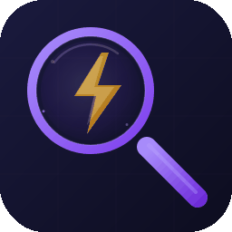

<p align="center">
  
</p>

# Epic Lens

**AI is changing how fast we ship code.** A feature that used to take days now lands in hours. But velocity without visibility is chaos — tickets pile up, MRs go stale overnight, and you start the next morning wondering *"what did I even ship yesterday?"*

Epic Lens gives you that visibility. It pulls your Jira epics, GitLab merge requests, and GitHub pull requests into a single VS Code sidebar so you can see everything at a glance: what's in progress, what's waiting for review, what's been approved, and what's stuck. When AI helps you move fast, Epic Lens helps you stay in control.

## Features

- **Sidebar tree view** — Epics with collapsible child issues, standalone issues listed below
- **Merge request tracking** — See all your open GitLab MRs and GitHub PRs with approval, pipeline, and conflict status
- **Pipeline monitoring** — Dedicated Pipelines view showing your recent CI/CD pipelines on default branches, with expandable job details
- **Provider cycling** — Toggle between Both / GitLab / GitHub with a single toolbar button
- **Dashboard** — Board and list views with status columns, progress bars, and stats
- **Live Jira data** — Pulls real statuses, assignees, and priorities from the Jira REST API
- **Scope filter** — Show only your epics (`mine`) or everything in the project (`all`)
- **Status/type filters** — Filter by status category, issue type, or hide done issues
- **Keyboard shortcuts** — Chord-based shortcuts with `Alt+E` as the leader key
- **Click to open** — Click any issue, epic, or MR to open it directly in the browser
- **Auto-refresh** — Periodic re-fetch of epics and MRs on a configurable interval (default 5 min)
- **Stale MR highlighting** — MRs older than a configurable threshold show a ⏰ indicator with age
- **Reviewer view** — See MRs where you are assigned as reviewer; cycle between Authored / Reviewing / All scopes
- **Status change notifications** — Toast alerts when an MR/PR or pipeline status changes between fetches, with an "Open" button
- **Jira-MR linking** — Automatically links MRs to Jira issues by parsing issue keys from branch names (e.g. `feat/DX-419-foo` → DX-419). Linked issues show a 🔗 count; tooltips show MR details
- **MR/PR dashboard section** — The dashboard now includes a Merge Requests section below the Kanban board with status colors, stale flags, and reviewer tags

## Quick Start

### Jira Setup

1. Install the extension
2. Open the command palette (`Ctrl+Shift+P`) and run **Epic Lens: Configure Jira Credentials**
3. Enter your Jira base URL, email, API token, and project key
4. Epics load automatically

### GitLab Setup

A **GitLab Personal Access Token** with `read_api` scope is required.

1. [Create a Personal Access Token](https://gitlab.com/-/user_settings/personal_access_tokens) with `read_api` scope
2. Run **Epic Lens: Configure GitLab Credentials** from the command palette (`Ctrl+Shift+P`)
3. Enter your GitLab host URL (defaults to `https://gitlab.com`)
4. Paste your token (stored securely in the OS keychain)

Alternatively, set the `GITLAB_TOKEN` environment variable or authenticate `glab` CLI with a PAT.

> **Note:** If you used `glab auth login` with browser-based OAuth2 (the default), the stored token won't work. You need a Personal Access Token.

### GitHub Setup

A **GitHub Personal Access Token** (classic or fine-grained) with `repo` scope is required.

1. [Create a Personal Access Token](https://github.com/settings/tokens) with `repo` scope
2. Run **Epic Lens: Configure GitHub Credentials** from the command palette (`Ctrl+Shift+P`)
3. Paste your token (stored securely in the OS keychain)

Alternatively, set the `GITHUB_TOKEN` environment variable or authenticate with `gh auth login` (PAT-based).

### Provider Cycling

The Merge Requests view has a toolbar button to cycle the provider filter:

**Both** → **GitLab Only** → **GitHub Only** → **Both** ...

Projects are prefixed with 🦊 (GitLab) or 🐙 (GitHub) when showing both providers.

A second toolbar button cycles the MR scope:

**Authored** → **Reviewing** → **All** → **Authored** ...

In Reviewing mode, only MRs where you are assigned as a reviewer are shown (marked with 📋). In All mode, both authored and reviewer MRs are shown.

### Pipelines View

The Pipelines view shows your recent CI/CD pipelines running on default branches (e.g. `main`), independent of any open MR. This is useful for monitoring post-merge pipelines.

- Fetches the 5 most recent pipelines per project that you triggered
- Queries your GitLab projects (by membership) and GitHub repos (by ownership)
- Pipelines are expandable to show individual job details with status and duration
- Provider cycling works the same as for MRs: **Both** → **GitLab** → **GitHub**
- Status change notifications fire when a pipeline transitions (e.g. running → failed)
- Included in auto-refresh alongside epics and MRs

### Generating a Jira API Token

1. Go to https://id.atlassian.com/manage-profile/security/api-tokens
2. Click **Create API token**
3. Copy the token and paste it when prompted by the configure command

## Settings

### Jira

| Setting | Default | Description |
|---------|---------|-------------|
| `epicLens.jiraBaseUrl` | `""` | Jira Cloud instance URL (e.g. `https://yourorg.atlassian.net`) |
| `epicLens.jiraEmail` | `""` | Jira account email for API authentication |
| `epicLens.jiraProject` | `""` | Jira project key (e.g. `MYPROJ`) |
| `epicLens.jiraScope` | `"mine"` | `"mine"` = your epics only, `"all"` = entire project |
| `epicLens.jiraJql` | `""` | Custom JQL (overrides project and scope when set) |
| `epicLens.hideDoneIssues` | `false` | Hide completed/done issues from the tree |
| `epicLens.scanOnStartup` | `true` | Automatically fetch from Jira, GitLab, and GitHub when VS Code starts |
| `epicLens.autoRefreshInterval` | `5` | Auto-refresh interval in minutes (0 to disable) |

### GitLab / GitHub

| Setting | Default | Description |
|---------|---------|-------------|
| `epicLens.gitlabHost` | `"https://gitlab.com"` | GitLab instance URL (for self-hosted, e.g. `https://gitlab.example.com`) |
| `epicLens.githubHost` | `"https://api.github.com"` | GitHub API URL (for GitHub Enterprise, e.g. `https://github.example.com/api/v3`) |
| `epicLens.staleMRDays` | `7` | Flag MRs older than this many days as stale with ⏰ indicator (0 to disable) |

### Authentication

**Jira** token is resolved in this order:

1. VS Code SecretStorage (OS keychain) — set via the configure command
2. `ATLASSIAN_TOKEN` environment variable — useful for CLI/CI environments

**GitLab** token is resolved in this order:

1. VS Code SecretStorage (OS keychain) — set via **Configure GitLab Credentials**
2. `GITLAB_TOKEN` environment variable
3. `glab` CLI config file (`~/.config/glab-cli/config.yml`) — PAT-based auth only, not OAuth2

**GitHub** token is resolved in this order:

1. VS Code SecretStorage (OS keychain) — set via **Configure GitHub Credentials**
2. `GITHUB_TOKEN` environment variable
3. `gh` CLI config file (`~/.config/gh/hosts.yml`)

## Keyboard Shortcuts

All shortcuts use `Alt+E` as a chord prefix:

| Shortcut | Command |
|----------|---------|
| `Alt+E S` | Fetch Epics from Jira |
| `Alt+E R` | Refresh Status |
| `Alt+E D` | Open Dashboard |
| `Alt+E F` | Filter by Status |
| `Alt+E T` | Filter by Type |
| `Alt+E H` | Toggle Hide Done |
| `Alt+E C` | Clear All Filters |
| `Alt+E M` | Fetch Merge Requests |
| `Alt+E P` | Fetch Pipelines |

## Commands

| Command | Description |
|---------|-------------|
| Epic Lens: Fetch Epics from Jira | Pull latest epics and issues |
| Epic Lens: Refresh Status | Re-fetch from Jira |
| Epic Lens: Open Dashboard | Open the interactive dashboard panel |
| Epic Lens: Filter by Status | Quick pick to filter by status category |
| Epic Lens: Filter by Type | Quick pick to filter by issue type |
| Epic Lens: Toggle Hide Done | Show/hide completed issues |
| Epic Lens: Clear All Filters | Reset all active filters |
| Epic Lens: Configure Jira Credentials | Guided setup for Jira connection |
| Epic Lens: Open in Jira | Open the selected issue in your browser |
| Epic Lens: Copy Issue Key | Copy the issue key to clipboard |
| Epic Lens: Fetch Merge Requests | Pull open MRs/PRs from GitLab and GitHub |
| Epic Lens: Refresh Merge Requests | Re-fetch MR/PR statuses |
| Epic Lens: Cycle Provider | Toggle between Both / GitLab / GitHub |
| Epic Lens: Cycle Scope | Toggle MR scope between Authored / Reviewing / All |
| Epic Lens: Open in Browser | Open the selected MR/PR in your browser |
| Epic Lens: Copy MR/PR URL | Copy the URL to clipboard |
| Epic Lens: Configure GitLab Credentials | Guided setup for GitLab connection |
| Epic Lens: Configure GitHub Credentials | Guided setup for GitHub connection |
| Epic Lens: Fetch Pipelines | Pull recent pipelines from GitLab and GitHub |
| Epic Lens: Refresh Pipelines | Re-fetch pipeline statuses |
| Epic Lens: Cycle Pipeline Provider | Toggle pipeline view between Both / GitLab / GitHub |
| Epic Lens: Open Pipeline in Browser | Open the selected pipeline in your browser |

## Status Categories

Jira statuses are mapped to these categories for filtering and display:

| Category | Statuses | Icon |
|----------|----------|------|
| Backlog | Backlog, To Do, Open, New, Queued | :clipboard: |
| In Progress | In Progress, In Development, Working | :arrows_counterclockwise: |
| Review | Review, In Review, Code Review, PR Review | :eyes: |
| QA | QA, Testing, In QA, Ready for QA | :test_tube: |
| Blocked | Blocked, On Hold, Waiting | :no_entry_sign: |
| Done | Done, Closed, Resolved, Complete | :white_check_mark: |
| Rejected | Won't Do, Cancelled, Rejected | :x: |

## Merge Request Status Indicators

Each MR in the sidebar shows a status based on its current state:

| Status | Icon | Meaning |
|--------|------|---------|
| Ready to merge | :white_check_mark: | Approved, pipeline passed, no conflicts |
| Approved | :+1: | Has approvals but may need other checks |
| Needs review | :eyes: | Waiting for reviewer approval |
| Draft | :pencil2: | Marked as draft, not ready for review |
| Pipeline failed | :x: | CI/CD pipeline failed |
| Pipeline running | :arrows_counterclockwise: | CI/CD pipeline in progress |
| Has conflicts | :warning: | Merge conflicts need resolution |
| Changes requested | :arrows_clockwise: | Reviewer requested changes (GitHub) |
| Unresolved discussions | :speech_balloon: | Open review threads to address (GitLab) |
| Stale | :alarm_clock: | MR/PR older than the configured `staleMRDays` threshold |

MRs are grouped by project when you have open MRs across multiple repositories. Click any MR to open it in GitLab, or right-click for additional options.

## Development

```bash
# Install dependencies
npm install
npm install --prefix webview-ui

# Build
make build

# Watch mode
make watch

# Package .vsix
make package

# Release (auto-bump from conventional commits)
make release

# Install locally
make install
```

## Andrevops Ecosystem

Epic Lens is part of the [Andrevops](https://github.com/Andrevops) developer tooling suite.

| Tool | Relationship |
|------|-------------|
| [Diffchestrator](https://github.com/Andrevops/diffchestrator) | Epic Lens consumes Diffchestrator's public API to filter epics and MRs by the currently selected repo. When you click a repo in Diffchestrator, Epic Lens can scope its view to that repo's issues and merge requests. |
| [Makestro](https://github.com/Andrevops/Makestro) | Sibling extension — both consume Diffchestrator's API for repo-aware context |
| [claude-sandbox](https://github.com/Andrevops/claude-sandbox) | Claude Code sessions launched via Diffchestrator's Yolo command generate the MRs and commits that Epic Lens tracks |
| [claude-stats](https://github.com/Andrevops/claude-stats) | Complementary CLI — analyzes the Claude Code sessions that produce the work Epic Lens gives visibility into |

## License

MIT
